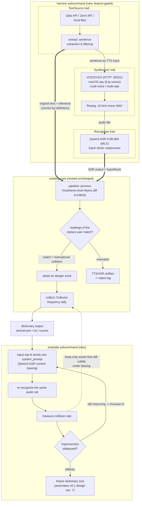

# biasdiff 仕様設計書

**他の言語で読む:** [English](SPEC.md)

biasdiff v0.2 の仕様: v0.1 の diff コアの上に載せる `harvest` / `evaluate`
自動化拡張。

| | |
| --- | --- |
| 状態 | Draft — 設計確定済み。実装手順は [harvest-implementation-plan.md](harvest-implementation-plan.md) |
| 日付 | 2026-06-10 |
| 範囲 | v0.1 コア（実装済み・要約）+ v0.2 自動化拡張（これから実装） |
| v0.1 設計記録 | [biasing-dict-diff-utility-design.md](biasing-dict-diff-utility-design.md) |

## 1. 目的

biasdiff は **同音異義語の危険語** — ASR コンテキストバイアシング辞書の
「仕上げ層」の素材 — を収集する。v0.1 のループは手動だった: ユーザーが正解文を
貼り、自分で読み上げ、ASR の結果を貼り、ツールが形態素単位で diff して
読みが一致する置換ペア（真の同音衝突）だけを採用する。

v0.2 は人間の読み上げ役をループから外す。核心の観察はこれである:

> **TTS エンジンに入力したテキストは、定義上、生成された音声の完璧な正解文で
> ある。** したがって「正解 + 音声」のペアを無人・大規模に生産でき、v0.1 の
> 原理 — *誤りの検出は推論ではなく照合* — は無改造でそのまま生きる。
> 以前と同様、LLM は一切不要。

v0.2 で追加するサブコマンドは2つ:

1. **`harvest`** — 人気の技術記事（Qiita / Zenn / ローカルファイル）を取得 →
   TTS で読める文を抽出 → 音声合成 → 音声認識 → 既存 diff コアを実行 →
   辞書を出力する。
2. **`evaluate`** — 辞書をコンテキストバイアシングとして認識器に戻し、
   同じ音声セットを再認識して、語を足しても改善しなくなる点を見つける。
   v0.1 設計書 7 章（「辞書サイズは理論ではなく実測の頭打ちで決める」）の
   自動化である。

## 2. 設計原則

v0.1 から継承:

- **推論ではなく照合。** フロンティアモデルもローカル LLM も不要。
- **完全ローカル。** ユーザーが生み出すもの（テキスト・音声・認識結果）は
  マシンから出ない。公開記事の取得は受信のみ。
- **出力は語のみ。** 文・文脈はいかなる出力ファイルにも現れず、辞書から
  元文を復元できない。
- **トレイト注入によるテスト容易性。** コアは抽象（v0.1 では `Tokenizer`）に
  依存し、実体エンジンは feature gate の向こうに置く。

v0.2 で新規:

- **単一 Rust バイナリがオーケストレータ。** 外部エンジン（VOICEVOX・`say`・
  ffmpeg・MLX 上の Qwen3-ASR）はローカル HTTP / subprocess で駆動し、
  コンパイル時依存には決してしない。
- **冪等なパイプライン。** 高価な生成物（取得記事・音声・認識結果）はすべて
  内容アドレスでキャッシュする。中断して再実行しても、支払い済みの仕事は
  二度と繰り返さない。

## 3. 全体像



太矢印が全体を支える一点の洞察を運ぶ: TTS への入力テキストが、そのまま
diff の正解（reference）を兼ねる。

## 4. モジュール構成

| モジュール | 状態 | Feature | 責務 |
| --- | --- | --- | --- |
| `token`, `diff`, `reading`, `pipeline`, `collect` | 既存・**無改造** | —（純粋） | 形態素 diff + 同音フィルタ + 集計 |
| `morph`, `cli`, `messages` | 既存 | `_lindera` | Lindera バックエンド・CLI |
| `source` | 新規 | —（純粋な型 + トレイト） | `TextSource`・`Article`・`Body` |
| `extract` | 新規 | —（純粋） | Markdown/HTML → フィルタ済みの文 |
| `synth` | 新規 | —（トレイト） | `Synthesizer`・`VoiceSpec` |
| `recognize` | 新規 | —（トレイト） | `Recognizer` |
| `vote` | 新規 | —（純粋） | 多声の頑健性投票 |
| `source_qiita`, `source_zenn`, `source_file` | 新規 | `harvest` | 取得アダプタ |
| `synth_voicevox`, `synth_say` | 新規 | `harvest` | TTS アダプタ |
| `asr_qwen3_mlx` | 新規 | `harvest` | ASR subprocess アダプタ（バッチドライバ） |
| `harvest`, `evaluate` | 新規 | `harvest` | オーケストレーション・キャッシュ・CLI 配線 |

```toml
[features]
harvest = ["_lindera", "dep:ureq", "dep:sha2", "dep:tempfile"]
```

依存の正確な集合は実装中に増えうるが、不変条件は **`default` には何も足さない**
こと — v0.1 のビルドは今日と同じ軽さを保つ。純粋モジュール（`source` の型・
`extract`・`vote`）は std のみで、ネットワーク・辞書・音声なしに単体テスト
できる。

## 5. 新しい抽象

```rust
/// One fetched article. The source declares its body format.
pub struct Article {
    pub id: String,        // cache / dedup key within a source
    pub title: String,
    pub url: String,
    pub popularity: u32,   // Qiita: stocks_count / Zenn: liked_count
    pub body: Body,
}

pub enum Body {
    Markdown(String), // Qiita
    Html(String),     // Zenn
    Plain(String),    // local files
}

/// Fetches candidate articles. Implementations stay thin; no parsing here.
pub trait TextSource {
    fn fetch(&self, n: usize) -> anyhow::Result<Vec<Article>>;
}

/// One synthesis configuration (engine voice id + speaking rate).
pub struct VoiceSpec {
    pub engine: String,   // "voicevox" | "say"
    pub voice: String,    // speaker id or voice name
    pub rate: f32,        // 1.0 = engine default
}

/// Synthesizes one sentence into `out` (16 kHz mono WAV). The orchestrator
/// chooses `out` — the content-addressed cache slot — so adapters carry no
/// cache knowledge.
pub trait Synthesizer {
    fn synth(&self, text: &str, voice: &VoiceSpec, out: &std::path::Path)
        -> anyhow::Result<()>;
}

/// Transcribes an audio file. `bias` carries dictionary words for context
/// biasing (mapped to Qwen3-ASR's system prompt); `None` = plain ASR.
pub trait Recognizer {
    fn recognize(&self, audio: &std::path::Path, bias: Option<&[String]>)
        -> anyhow::Result<String>;
}
```

v0.1 の `Tokenizer` と同じ依存性注入の流儀: オーケストレーションは `&dyn` を
持ち、テストはモックを差し、アダプタは `harvest` の向こうに置く。

## 6. 取得層

エンドポイントの形状は 2026-06-10 に実際に叩いて検証済み:

```
# Qiita (official API v2) — body arrives as raw Markdown
GET https://qiita.com/api/v2/items?per_page=100&query=stocks:>=50+tag:rust
  -> [{ id, title, url, body (Markdown), likes_count, stocks_count, tags, ... }]
  rate limit: 60 req/h anonymous, 1000 req/h with `Authorization: Bearer $QIITA_TOKEN`

# Zenn (unofficial API) — list gives metadata only; body via detail endpoint
GET https://zenn.dev/api/articles?order=weekly&topicname=rust&count=50
  -> { articles: [{ id, title, slug, path, liked_count, ... }] }   # no body
GET https://zenn.dev/api/articles/{slug}
  -> { article: { ..., body_html } }
```

ソースごとの規律:

- **Qiita** — 公式 API を規約の範囲内で使う。1 リクエストで本文込みの最大
  100 件が返るため、キャッシュとの相性が非常に良い。`QIITA_TOKEN`
  （環境変数・任意）はレート上限を引き上げ、qiita.com にのみ送られる。
- **Zenn** — 非公式 API なので、行儀の良さを構造で強制する: 最大 1 リクエスト/秒、
  ツール名を明示した User-Agent、キャッシュ命中時はリクエストゼロ、使うのは
  上記 2 つの JSON エンドポイントのみ（ページのスクレイピングはしない）。
  API の形が変わった場合のフォールバックは RSS（`/topics/{topic}/feed`）。
- **FileSource** — プレーンテキストや事前ダウンロードしたダンプ。ネットワークに
  一切触れたくないときの完全オフライン経路。

人気記事を選ぶのは意図的である: 人気は整った文章（TTS 入力に向く）と、実際に
流通している用語 — バイアシングする価値のある語 — に相関する。

## 7. 例文化（`extract`）

技術記事はコードフェンス・URL・英語識別子だらけである。これを TTS に
素通しするとゴミの置換ペアが生まれ、後段のどのフィルタでも確実には除去
できない — **辞書の純度はここで決まる**。読み一致フィルタより前に。

段階（すべて純粋関数・std のみ）:

1. **構造除去** — コードフェンス・インラインコード・URL・画像・表・HTML タグ・
   見出し/引用記号。Markdown 用と HTML 用のフロントエンドが同じ平文に正規化する。
2. **文分割** — 。！？ と改行で切る。
3. **フィルタ** — 文長 20〜80 字（TTS 1 発話・diff 1 行）。日本語文字率 ≥ 0.5。
   記号の残骸を含む文は捨てる。
4. **スコアリング** — 漢字含有率の高い文を優先する（同音衝突は漢語に集中する）。
   記事あたりの文数に上限（既定 20）を設け、1 本の長い記事が収穫を支配しない
   ようにする。
5. **重複排除** — 正規化ハッシュで、記事間・実行間（`seen.jsonl` に永続化）の
   両方で重複を弾く。

指針: **迷ったら捨てる。** 記事は豊富にある。重要なのは精度であって網羅では
ない。

## 8. 音声合成層

- **VOICEVOX**（主力）— ローカル HTTP エンジン:

  ```
  POST http://127.0.0.1:50021/audio_query?speaker={id}&text={sentence}
  POST http://127.0.0.1:50021/synthesis?speaker={id}   (body: the audio_query JSON)
    -> WAV bytes
  # speaking rate: set "speedScale" in the audio_query JSON before /synthesis
  ```

- **`say`**（フォールバック・追加導入ゼロ）— macOS 内蔵、日本語 9 話者。
- すべての音声は ffmpeg で **16 kHz mono WAV** に正規化する — これが認識層の
  入力契約である。
- CLI は **声のマトリクス**（話者 × 速度）を構成し、各文はセルごとに 1 回
  合成される（キャッシュが効く）。

**TTS の読み誤りは構造的にフェイルセーフである。** TTS が読みを誤った場合
（固有名詞など）、ASR は実際に発話された音を書き起こすので、正解側の読み
（元テキストへの Lindera）と食い違い、そのペアは辞書ではなく除外ログに落ちる。
残るリスク（誤読がたまたま別の実在語の読みと衝突する場合）は多声投票
（11 章）で抑える。

## 9. 音声認識層

- **エンジン**: MLX 上で動く Qwen3-ASR（Apache-2.0）。mlx-audio 経由。
  モデル: `mlx-community/Qwen3-ASR-0.6B-8bit`（既定）/
  `mlx-community/Qwen3-ASR-1.7B-8bit`。日本語は明示サポート。
- **バッチドライバ契約** — 高コストなのはモデルロードなので、アダプタは
  モデルを 1 回だけロードする小さな同梱 Python ドライバと JSONL で会話する:

  ```
  # scripts/qwen3_asr_batch.py — JSONL, one object per line
  stdin:  {"id": "...", "audio": "/path/x.wav", "bias": ["機械", "意思"]}   # bias may be null
  stdout: {"id": "...", "ok": true,  "text": "..."}
          {"id": "...", "ok": false, "error": "..."}
  # the model is loaded once per process; bias maps to the system prompt
  ```

- **バイアシング**: `bias` の語はモデルの **system プロンプト**経由で注入する —
  半角スペース区切り・前置きなし（公式 Qwen3-ASR の `context` 例と同じ）。
  mlx-audio のソースで検証済み: `generate(..., system_prompt=...)` →
  `_build_prompt` が `<|im_start|>system` ロールに配置する。
- **ドライバは単なる高速化ではなく、バイアシングの唯一の経路。** mlx-audio
  0.4.4 の CLI は `--context` を受けるが、kwargs を
  `inspect.signature(model.generate)` で濾すため、Qwen3 の generate に無い
  `context` は**黙って捨てられる**（導入済みソースを読んで確認。Q1 を解決）。
  バイアシングは Python API の `system_prompt=`、すなわちこのドライバ経由で
  しか届かない。ドライバの高速化実測: 10 文 ≈ 21 秒（1 ファイル 1 プロセス）
  → ≈ 4 秒（ドライバ）。

## 10. 既存コアの再利用

`pipeline::process(tokenizer, reference, hypothesis, opts)` は**無改造**で
再利用する: `reference` は TTS に送った文そのもの、`hypothesis` は ASR の
出力。`NormalizeOptions` の意味（`--strict`・読みゆれ正規化）は v0.1 と
完全に同じ。

## 11. 頑健性投票（`vote`)

声のマトリクスが複数セルあるとき、置換ペアは少なくとも `--min-votes` 個の
**異なる話者**で観測された場合にのみ採用する（既定: 話者が 2 以上構成されて
いれば 2、それ以外は 1）。これにより、エンジン固有の TTS の癖が単独で辞書
エントリを作ることはできなくなる。投票は `Collector::add` の前段で行い、
それ以降の頻度集計の意味は変えない。

## 12. キャッシュと冪等性

```
harvest_cache/
  articles/{source}/{id}.json   # fetched articles (API not hit again on re-run)
  seen.jsonl                    # processed article ids + sentence hashes
  refs.jsonl                    # audio-key -> reference sentence (evaluate's input)
  audio/{sha256(text|engine|voice|rate)}.wav   # TTS output (most expensive asset)
  asr/{sha256(audio-key|model)}.txt   # recognition results (without bias);
                                      # the model name is part of the key, so
                                      # switching models never reuses stale text
  asr-biased/{sha256(audio-key|model|bias-words)}.txt
                                # recognition under biasing; the joined word
                                # list is part of the key, so a changed
                                # dictionary never reuses stale results
```

音声と認識結果は内容アドレスで管理する。`harvest` の中断・再実行や、同じ
音声セットへの `evaluate` の繰り返しが、ディスク上にあるものを再合成・
再認識することはない。認識結果のキーにはモデル名が入るため、モデルを
切り替えても古い結果を流用しない。書き込みは一時ファイル + rename で行い、
中断による半端なファイルがキャッシュ命中と誤認されることもない。`--cache-dir` の既定は `./harvest_cache` で、より速い
ディスクを指してもよい。キャッシュディレクトリは git-ignore する —
記事本文を含むため、決してコミットしてはならない。

## 13. CLI

```sh
# Collect: fetch -> extract -> TTS -> ASR -> diff -> dictionary
biasdiff harvest \
  --source qiita --query "stocks:>=50 tag:rust" \
  --source zenn  --topic rust --order weekly \
  --count 100 \
  --tts voicevox --voices 3,8 --rates 0.9,1.1 \
  --asr qwen3-mlx \
  --cache-dir ./harvest_cache \
  --format amical-json --field dev -o dev.biasing.json

# Inspect extraction quality without spending TTS/ASR time
biasdiff harvest --source qiita --query "stocks:>=20 tag:rust" --count 5 --dry-run

# Evaluate: find the plateau point of the dictionary
biasdiff evaluate \
  --input dev.biasing.json \
  --cache-dir ./harvest_cache \
  --step 25 --max-words 300 \
  --report curve.tsv
# (--input, not --dict: --dict is the global morphological-dictionary switch)
```

`harvest` のオプション: `--source` は繰り返し指定可（`qiita` | `zenn` |
`file`）。ソース別オプション（Qiita は `--query`、Zenn は `--topic` /
`--order`、ファイルは `--input`）。`--count` はソースごとの記事数上限。
`--tts`・`--voices`・`--rates` が声のマトリクスを定める。`--asr`・`--model`
が認識器を選ぶ。`--min-votes` は投票の閾値。`--dry-run` は例文化で止めて
文を表示する。出力オプション（`--format`・`--field`・`-o`・`--reject`）と
グローバルオプション（`--dict`・`--strict`）は v0.1 と共通。

`evaluate` のオプション: `--input`（試験する辞書ファイル）、`--cache-dir`（収穫済みの
音声 + 正解を再利用）、`--step` / `--max-words`（N のスケジュール）、
`--min-delta` / `--patience`（頭打ち判定）、`--report`（TSV カーブ）、
`--prune`（実際に衝突を直した語だけの部分集合を出力）。

## 14. `evaluate` のアルゴリズム

```
input: dictionary D (count-desc), cached audio set A with references R
for N in 0, step, 2*step, ..., max-words:
    bias = first N words of D
    for (audio, ref) in (A, R):
        hyp = recognize(audio, bias)          # cached per (audio, N)
        collisions[N] += homophone_replacements(ref, hyp)   # existing classifier
    rate[N] = collisions[N] / |A|
plateau: improvement < min-delta for `patience` consecutive steps
output: curve.tsv lines "N<TAB>collisions<TAB>rate"; recommend smallest N at plateau
```

*衝突（collision）*とは、既存 v0.1 パイプラインが分類する「採用された同音
置換」のことである — 指標は辞書を作ったのと同じコードで計算される。全体像の
点線フィードバックは `--prune` に対応する: 辞書に入れたら衝突が消えた語を
残し、それ以外を落とす — コンテキスト予算のコストに見合う語だけに収束する。

## 15. プライバシー

マシンから出るもの: `qiita.com` / `zenn.dev` への HTTPS GET のみ。運ぶのは
公開のクエリパラメータ（タグ・トピック名・人気の閾値・公開記事の slug）—
公開済みコンテンツの受信専用の取得である。任意の `QIITA_TOKEN` は qiita.com
にのみ送られる。

決して出ないもの: 記事本文（ローカルキャッシュ）・抽出した文・生成音声・
認識結果・除外ログ。

出力ファイルは v0.1 と同じく**語と回数のみ**を含む。
[PRIVACY-AUDIT.md](PRIVACY-AUDIT.md) のチェックリストは新しい生成物にも
適用し、`harvest_cache/` は git-ignore する。

## 16. 決定事項

| # | 日付 | 決定 |
| --- | --- | --- |
| D1 | 2026-06-10 | エンジンは完全ローカルのみ（VOICEVOX / `say` / ffmpeg / MLX 上の Qwen3-ASR）。クラウド TTS/ASR は使わない。 |
| D2 | 2026-06-10 | 単一 Rust バイナリ。エンジンは subprocess / ローカル HTTP 経由。`default` feature には何も足さない。 |
| D3 | 2026-06-10 | ASR = mlx-audio 経由の Qwen3-ASR、既定 `0.6B-8bit`。バイアシングは `system_prompt`（ソース検証済み）。 |
| D4 | 2026-06-10 | 初期ソース = Qiita（公式 API）+ Zenn（非公式・行儀モード）+ FileSource。エンドポイントは実地検証済み。 |
| D5 | 2026-06-10 | `extract` は純粋・std のみ。網羅より精度（「迷ったら捨てる」）。 |
| D6 | 2026-06-10 | `evaluate` はキャッシュ済み音声を再利用。指標は既存分類器が計算する衝突率。 |

## 17. 未決事項

| # | 問い | 解決の道筋 |
| --- | --- | --- |
| Q1 | ~~バイアシングプロンプトの正確な書式（区切り・前置き）。~~ **2026-06-10 解決**: 半角スペース区切り・前置きなしで Python API の `system_prompt=` に渡す（0.4.4 の CLI `--context` は signature フィルタで Qwen3 に届かない）。実機検証済み: bias なしの誤認識「非会学習」が、収穫済み辞書の投入で「機械学習」に直った。 | Step 4 で解決（9 章参照）。 |
| Q2 | 日本語での 0.6B と 1.7B の精度/速度トレードオフ。 | Step 1 で同じ文セットを両方でベンチする。 |
| Q3 | TTS で収穫した衝突は人間の発話に転移するか。 | Step 0 で最初の実測。以後も v0.1 の手動 repl と定期的に突き合わせる。 |
| Q4 | 読みを UniDic（`--features unidic`）に切り替える時期。 | v0.1 から変わらない選択肢。除外ログを読み不一致が支配したら再検討。 |

## 18. スコープ外

- ストリーミング / リアルタイム認識。
- 人間の声のコーパス収集（そのための v0.1 `repl` は残る）。
- 日本語以外の言語。
- 網羅 — v0.1 の姿勢のまま: 頭打ちで止める。
- `harvest` の GUI 化（後で可能。契約は CLI）。

## ライセンス

Apache-2.0 または MIT のいずれか（クレートと同じ）。
