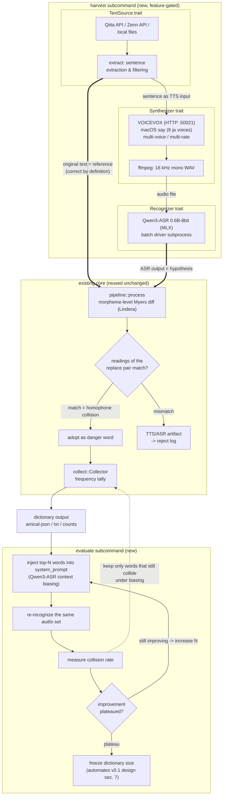

# biasdiff SPEC

**Read this in other languages:** [日本語](SPEC.ja.md)

Specification for biasdiff v0.2: the `harvest` / `evaluate` automation extension
built on top of the v0.1 diff core.

| | |
| --- | --- |
| Status | Draft — design frozen; implementation steps in [harvest-implementation-plan.md](harvest-implementation-plan.md) (Japanese) |
| Date | 2026-06-10 |
| Covers | v0.1 core (as built, summarized) + v0.2 automation extension (to be built) |
| v0.1 design record | [biasing-dict-diff-utility-design.md](biasing-dict-diff-utility-design.md) (Japanese) |

## 1. Purpose

biasdiff collects **homophone confusion words** — the raw material for the
"finishing layer" of an ASR context-biasing dictionary. The v0.1 loop is manual:
the user pastes a reference sentence, reads it aloud, pastes the ASR result,
and the tool diffs the two at the morpheme level, keeping only replacement
pairs whose readings match (genuine homophone collisions).

v0.2 removes the human reader from the loop. The key observation:

> **The text fed to a TTS engine is, by definition, the correct transcript of
> the audio it generates.** Therefore "reference + audio" pairs can be produced
> unattended and at scale, and the v0.1 principle — *error detection is
> comparison, not inference* — carries over unchanged. No LLM is needed,
> exactly as before.

v0.2 adds two subcommands:

1. **`harvest`** — fetch popular tech articles (Qiita / Zenn / local files) →
   extract TTS-readable sentences → synthesize speech → recognize it → run the
   existing diff core → emit the dictionary.
2. **`evaluate`** — feed the dictionary back into the recognizer as context
   biasing, re-recognize the same audio set, and find the point where adding
   more words stops helping. This automates sec. 7 of the v0.1 design
   ("size the dictionary by the measured plateau, not by theory").

## 2. Design principles

Inherited from v0.1:

- **Comparison, not inference.** No frontier model, no local LLM.
- **Fully local.** Nothing the user produces (text, audio, recognition output)
  leaves the machine. Fetching public articles is receive-only.
- **The output is words only.** Sentences and contexts never appear in any
  output file; the originals cannot be reconstructed from the dictionary.
- **Testability via trait injection.** The core depends on abstractions
  (`Tokenizer` in v0.1); concrete engines live behind feature gates.

New in v0.2:

- **Single Rust binary as orchestrator.** External engines (VOICEVOX, `say`,
  ffmpeg, Qwen3-ASR on MLX) are driven via local HTTP / subprocess and never
  become compile-time dependencies.
- **Idempotent pipeline.** Every expensive artifact (fetched article, audio,
  recognition) is content-addressed and cached. Interrupting and re-running
  never repeats paid work.

## 3. System overview



The thick arrows carry the one insight everything hangs on: the TTS input
doubles as the diff reference.

## 4. Module layout

| Module | Status | Feature | Responsibility |
| --- | --- | --- | --- |
| `token`, `diff`, `reading`, `pipeline`, `collect` | existing, **unchanged** | — (pure) | morpheme diff + homophone filter + tally |
| `morph`, `cli`, `messages` | existing | `_lindera` | Lindera backend, CLI |
| `source` | new | — (pure types + trait) | `TextSource`, `Article`, `Body` |
| `extract` | new | — (pure) | Markdown/HTML → filtered sentences |
| `synth` | new | — (trait) | `Synthesizer`, `VoiceSpec` |
| `recognize` | new | — (trait) | `Recognizer` |
| `vote` | new | — (pure) | multi-voice robustness voting |
| `source_qiita`, `source_zenn`, `source_file` | new | `harvest` | acquisition adapters |
| `synth_voicevox`, `synth_say` | new | `harvest` | TTS adapters |
| `asr_qwen3_mlx` | new | `harvest` | ASR subprocess adapter (batch driver) |
| `harvest`, `evaluate` | new | `harvest` | orchestration, cache, CLI wiring |

```toml
[features]
harvest = ["_lindera", "dep:ureq", "dep:sha2", "dep:tempfile"]
```

The exact dependency set may grow during implementation; the invariant is that
**nothing is added to `default`** — the v0.1 build stays as light as today.
Pure modules (`source` types, `extract`, `vote`) are std-only and unit-testable
without network, dictionaries, or audio.

## 5. New abstractions

```rust
/// One fetched article. The source declares its body format.
pub struct Article {
    pub id: String,        // cache / dedup key within a source
    pub title: String,
    pub url: String,
    pub popularity: u32,   // Qiita: stocks_count / Zenn: liked_count
    pub body: Body,
}

pub enum Body {
    Markdown(String), // Qiita
    Html(String),     // Zenn
    Plain(String),    // local files
}

/// Fetches candidate articles. Implementations stay thin; no parsing here.
pub trait TextSource {
    fn fetch(&self, n: usize) -> anyhow::Result<Vec<Article>>;
}

/// One synthesis configuration (engine voice id + speaking rate).
pub struct VoiceSpec {
    pub engine: String,   // "voicevox" | "say"
    pub voice: String,    // speaker id or voice name
    pub rate: f32,        // 1.0 = engine default
}

/// Synthesizes one sentence into `out` (16 kHz mono WAV). The orchestrator
/// chooses `out` — the content-addressed cache slot — so adapters carry no
/// cache knowledge.
pub trait Synthesizer {
    fn synth(&self, text: &str, voice: &VoiceSpec, out: &std::path::Path)
        -> anyhow::Result<()>;
}

/// Transcribes an audio file. `bias` carries dictionary words for context
/// biasing (mapped to Qwen3-ASR's system prompt); `None` = plain ASR.
pub trait Recognizer {
    fn recognize(&self, audio: &std::path::Path, bias: Option<&[String]>)
        -> anyhow::Result<String>;
}
```

Same dependency-injection style as v0.1's `Tokenizer`: orchestration code holds
`&dyn` references, tests substitute mocks, adapters stay behind `harvest`.

## 6. Acquisition layer

Endpoint shapes were verified live on 2026-06-10:

```
# Qiita (official API v2) — body arrives as raw Markdown
GET https://qiita.com/api/v2/items?per_page=100&query=stocks:>=50+tag:rust
  -> [{ id, title, url, body (Markdown), likes_count, stocks_count, tags, ... }]
  rate limit: 60 req/h anonymous, 1000 req/h with `Authorization: Bearer $QIITA_TOKEN`

# Zenn (unofficial API) — list gives metadata only; body via detail endpoint
GET https://zenn.dev/api/articles?order=weekly&topicname=rust&count=50
  -> { articles: [{ id, title, slug, path, liked_count, ... }] }   # no body
GET https://zenn.dev/api/articles/{slug}
  -> { article: { ..., body_html } }
```

Rules per source:

- **Qiita** — official API, used within its terms. One request returns up to
  100 items *including bodies*, so it is very cache-friendly. `QIITA_TOKEN`
  (env var, optional) raises the rate limit and is sent only to qiita.com.
- **Zenn** — unofficial API, so politeness is enforced by construction:
  at most 1 request/second, an explicit User-Agent identifying the tool,
  cache hits issue zero requests, and only the two JSON endpoints above are
  used (no page scraping). RSS (`/topics/{topic}/feed`) is the fallback if the
  API shape changes.
- **FileSource** — plain text files or pre-downloaded dumps; the fully-offline
  path when no network should be touched at all.

Popular articles are chosen deliberately: popularity correlates with
well-formed prose (better TTS input) and with terminology that actually
circulates — the words worth biasing.

## 7. Sentence extraction (`extract`)

Tech articles are full of code fences, URLs, and English identifiers. Feeding
those to TTS produces garbage pairs that no later filter can clean reliably —
**dictionary purity is decided here**, before the reading filter ever runs.

Stages (all pure functions, std-only):

1. **Structure removal** — code fences, inline code, URLs, images, tables,
   HTML tags, heading/quote markers. Markdown and HTML front-ends normalize
   into the same plain text.
2. **Sentence split** — on 。！？ and newlines.
3. **Filters** — length 20–80 chars (one TTS utterance, one diff line);
   Japanese-character ratio ≥ 0.5; no leftover symbol debris.
4. **Scoring** — prefer high kanji density (homophone collisions concentrate
   in Sino-Japanese compounds); cap sentences per article (default 20) so one
   long article cannot dominate the harvest.
5. **Dedup** — normalized-hash dedup across articles *and* across runs
   (persisted in `seen.jsonl`).

Guiding principle: **drop when unsure.** Articles are abundant; precision
matters, recall does not.

## 8. Synthesis layer

- **VOICEVOX** (primary) — local HTTP engine:

  ```
  POST http://127.0.0.1:50021/audio_query?speaker={id}&text={sentence}
  POST http://127.0.0.1:50021/synthesis?speaker={id}   (body: the audio_query JSON)
    -> WAV bytes
  # speaking rate: set "speedScale" in the audio_query JSON before /synthesis
  ```

- **`say`** (fallback, zero-install) — macOS built-in, 9 Japanese voices.
- All audio is normalized to **16 kHz mono WAV** via ffmpeg — the input
  contract of the recognition layer.
- The CLI configures a **voice matrix** (voices × rates); each sentence is
  synthesized once per cell, subject to the cache.

**TTS misreadings are fail-safe by construction.** If the TTS picks a wrong
reading (proper nouns etc.), the ASR transcribes what was actually said; the
reference reading (Lindera on the original text) then disagrees, and the pair
lands in the reject log — not the dictionary. The residual risk (a
mispronunciation that happens to collide with another real word) is mitigated
by multi-voice voting (sec. 11).

## 9. Recognition layer

- **Engine**: Qwen3-ASR (Apache-2.0) running on MLX via mlx-audio.
  Models: `mlx-community/Qwen3-ASR-0.6B-8bit` (default) /
  `mlx-community/Qwen3-ASR-1.7B-8bit`. Japanese is explicitly supported.
- **Batch driver contract** — model load is the expensive part, so the adapter
  talks JSONL to a small bundled Python driver that loads the model once:

  ```
  # scripts/qwen3_asr_batch.py — JSONL, one object per line
  stdin:  {"id": "...", "audio": "/path/x.wav", "bias": ["機械", "意思"]}   # bias may be null
  stdout: {"id": "...", "ok": true,  "text": "..."}
          {"id": "...", "ok": false, "error": "..."}
  # the model is loaded once per process; bias maps to the system prompt
  ```

- **Biasing**: `bias` words are injected via the model's **system prompt** —
  joined by single spaces, no preamble (matches the official Qwen3-ASR
  `context` examples). Verified in the mlx-audio source:
  `generate(..., system_prompt=...)` → `_build_prompt` places it into the
  `<|im_start|>system` role.
- **The driver is the only biasing path, not just an optimization.** The
  mlx-audio 0.4.4 CLI accepts `--context` but filters kwargs by
  `inspect.signature(model.generate)`, and the Qwen3 signature has no
  `context` parameter — the flag is silently dropped (confirmed by reading
  the installed source; resolves Q1). Biasing therefore must go through the
  Python API's `system_prompt=`, i.e. through this driver. Measured driver
  speedup: 10 sentences ≈ 21 s (one process per file) → ≈ 4 s (driver).

## 10. Core reuse

`pipeline::process(tokenizer, reference, hypothesis, opts)` is reused
**unchanged**: `reference` is the exact sentence string sent to the TTS,
`hypothesis` is the ASR output. `NormalizeOptions` semantics (`--strict`,
reading-yure folding) apply exactly as in v0.1.

## 11. Robustness voting (`vote`)

With a multi-cell voice matrix, a replacement pair is adopted only if it is
observed under at least `--min-votes` **distinct voices** (default: 2 when ≥2
voices are configured, otherwise 1). Engine-specific TTS quirks therefore
cannot create dictionary entries on their own. Voting happens before
`Collector::add`; counting semantics downstream are unchanged.

## 12. Cache & idempotency

```
harvest_cache/
  articles/{source}/{id}.json   # fetched articles (API not hit again on re-run)
  seen.jsonl                    # processed article ids + sentence hashes
  refs.jsonl                    # audio-key -> reference sentence (evaluate's input)
  audio/{sha256(text|engine|voice|rate)}.wav   # TTS output (most expensive asset)
  asr/{sha256(audio-key|model)}.txt   # recognition results (without bias);
                                      # the model name is part of the key, so
                                      # switching models never reuses stale text
  asr-biased/{sha256(audio-key|model|bias-words)}.txt
                                # recognition under biasing; the joined word
                                # list is part of the key, so a changed
                                # dictionary never reuses stale results
```

Audio and recognitions are content-addressed; interrupting `harvest`, or
running `evaluate` many times over the same audio set, never re-synthesizes or
re-recognizes anything already on disk. Writes go through a temp file +
rename, so an interrupted run cannot leave a truncated file that would later
be mistaken for a cache hit. `--cache-dir` defaults to
`./harvest_cache` and may point at a faster disk. The cache directory is
git-ignored — it contains article bodies and must never be committed.

## 13. CLI

```sh
# Collect: fetch -> extract -> TTS -> ASR -> diff -> dictionary
biasdiff harvest \
  --source qiita --query "stocks:>=50 tag:rust" \
  --source zenn  --topic rust --order weekly \
  --count 100 \
  --tts voicevox --voices 3,8 --rates 0.9,1.1 \
  --asr qwen3-mlx \
  --cache-dir ./harvest_cache \
  --format amical-json --field dev -o dev.biasing.json

# Inspect extraction quality without spending TTS/ASR time
biasdiff harvest --source qiita --query "stocks:>=20 tag:rust" --count 5 --dry-run

# Evaluate: find the plateau point of the dictionary
biasdiff evaluate \
  --input dev.biasing.json \
  --cache-dir ./harvest_cache \
  --step 25 --max-words 300 \
  --report curve.tsv
# (--input, not --dict: --dict is the global morphological-dictionary switch)
```

`harvest` options: `--source` is repeatable (`qiita` | `zenn` | `file`), with
per-source options (`--query` for Qiita, `--topic` / `--order` for Zenn,
`--input` for files); `--count` caps articles per source; `--tts`, `--voices`,
`--rates` define the voice matrix; `--asr`, `--model` select the recognizer;
`--min-votes` sets the voting threshold; `--dry-run` stops after extraction
and prints the sentences. Output options (`--format`, `--field`, `-o`,
`--reject`) and global options (`--dict`, `--strict`) are shared with v0.1.

`evaluate` options: `--input` (the dictionary file to test), `--cache-dir` (reuses
harvested audio + references), `--step` / `--max-words` (the N schedule),
`--min-delta` / `--patience` (plateau detection), `--report` (TSV curve),
`--prune` (emit the subset of words observed to actually fix collisions).

## 14. `evaluate` algorithm

```
input: dictionary D (count-desc), cached audio set A with references R
for N in 0, step, 2*step, ..., max-words:
    bias = first N words of D
    for (audio, ref) in (A, R):
        hyp = recognize(audio, bias)          # cached per (audio, N)
        collisions[N] += homophone_replacements(ref, hyp)   # existing classifier
    rate[N] = collisions[N] / |A|
plateau: improvement < min-delta for `patience` consecutive steps
output: curve.tsv lines "N<TAB>collisions<TAB>rate"; recommend smallest N at plateau
```

A *collision* is an adopted homophone replacement as classified by the
existing v0.1 pipeline — the metric is computed by the same code that built
the dictionary. The dotted feedback edge in the overview: with `--prune`,
words whose collisions disappear once included are kept, the rest dropped —
converging on the words that actually pay for their context-budget cost.

## 15. Privacy

What leaves the machine: HTTPS GETs to `qiita.com` / `zenn.dev` only, carrying
public query parameters (tags, topic names, popularity thresholds, public
article slugs) — receive-only acquisition of published content. The optional
`QIITA_TOKEN` is sent only to qiita.com.

What never leaves: article bodies (local cache), extracted sentences,
generated audio, recognition output, reject logs.

Output files contain **words and counts only**, as in v0.1; the
[PRIVACY-AUDIT.md](PRIVACY-AUDIT.md) checklist extends to the new artifacts,
and `harvest_cache/` is git-ignored.

## 16. Decisions

| # | Date | Decision |
| --- | --- | --- |
| D1 | 2026-06-10 | Fully-local engines only (VOICEVOX / `say` / ffmpeg / Qwen3-ASR on MLX); no cloud TTS/ASR. |
| D2 | 2026-06-10 | Single Rust binary; engines via subprocess / local HTTP; nothing added to `default` features. |
| D3 | 2026-06-10 | ASR = Qwen3-ASR via mlx-audio, `0.6B-8bit` default; biasing via `system_prompt` (source-verified). |
| D4 | 2026-06-10 | First sources = Qiita (official API) + Zenn (unofficial, politeness mode) + FileSource; endpoints live-verified. |
| D5 | 2026-06-10 | `extract` is pure and std-only; precision over recall ("drop when unsure"). |
| D6 | 2026-06-10 | `evaluate` reuses cached audio; the metric is the collision rate computed by the existing classifier. |

## 17. Open questions

| # | Question | Resolution path |
| --- | --- | --- |
| Q1 | ~~Exact biasing prompt format (separator, preamble).~~ **Resolved 2026-06-10**: words joined by single spaces, no preamble, passed to the Python API's `system_prompt=` (the 0.4.4 CLI `--context` never reaches Qwen3 — dropped by signature filtering). Verified live: an unbiased "非会学習" misrecognition was fixed to "機械学習" by biasing with the harvested dictionary. | Closed in Step 4 (see sec. 9). |
| Q2 | 0.6B vs 1.7B accuracy/speed trade-off for Japanese. | Benchmark both in Step 1 on the same sentence set. |
| Q3 | Do TTS-harvested collisions transfer to human speech? | First measurement in Step 0; spot-check against the v0.1 manual repl periodically. |
| Q4 | When to switch readings to UniDic (`--features unidic`). | Unchanged option from v0.1; revisit if reading mismatches dominate the reject log. |

## 18. Out of scope

- Streaming / real-time recognition.
- Collecting human-voice corpora (the v0.1 `repl` remains for that).
- Languages other than Japanese.
- Exhaustive coverage — the v0.1 stance is unchanged: stop at the plateau.
- GUI automation of `harvest` (possible later; the CLI is the contract).

## License

Licensed under either of Apache-2.0 or MIT, at your option (same as the crate).
