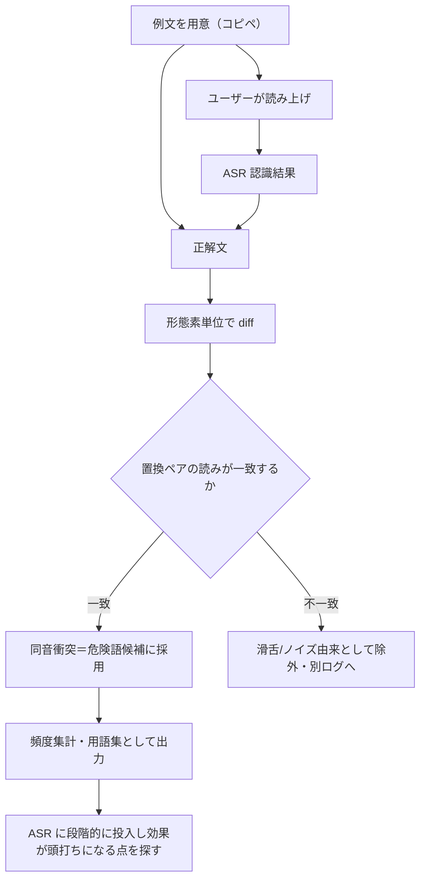

# コンテキストバイアシング辞書構築のための diff 照合ユーティリティ 設計

## 1. 目的

ASR（音声テキスト変換）にコンテキストとして渡す用語集——とくに**同音異義語の出し分けに効く「仕上げ層」**——の素材を、低コストかつプライバシーを保ったまま集めるためのユーティリティを設計する。

中心となる発想は単純で、**正解（コピペで用意した例文）と ASR の認識結果との diff を取り、食い違った語を危険語候補として溜める**だけである。正解が手元にある以上、誤変換の検出は推論ではなく照合で済み、高精度なモデルを必要としない。

## 2. 前提とした設計判断

これまでの検討で確定している前提を、設計の土台として明記しておく。

- 辞書には二つの層がある。**土台層**（分野代表の頻出語。場の重心を作る）と、**仕上げ層**（同音衝突する危険語。出し分けを確定させる）。本ユーティリティは主に後者の素材を作る。
- 渡せるトークンには上限があり、辞書は構造的に小さい。狙う規模は**せいぜい 300 語程度**。網羅は目的にしない。
- 誤変換の検出に正解文を使うため、フロンティアモデルもローカル LLM も不要。**入力例文は自分の意思で選んだものに限る**ので、外部に出して困る中身は最初から含まれない。
- 過去履歴の全文発掘は行わない（プライバシーと手間の両面で割に合わない）。本ツールは「これから読む例文」だけを扱う。

## 3. データフロー

外部ネットワークに出るデータは一切ない。すべてローカルで完結する。

## 4. 各処理の詳細

### 4.1 入力

- **正解文**：ユーザーが任意のテキストからコピペで用意する。同音衝突を含みやすい分野テキストを選ぶと収穫が上がる。
- **認識結果**：その正解文を読み上げて得た ASR の出力。

両者をペアで受け取る。一度に一文でも、複数文をまとめてでもよい。

### 4.2 形態素単位の diff

文字単位の diff だと「語」として扱いにくいため、**正解文・認識結果をそれぞれ形態素解析してトークン列にし、トークン列同士で diff を取る**。

- diff アルゴリズムは Myers 系の標準的な実装で足りる。
- 関心があるのは **置換（replace）**箇所。挿入・削除は誤変換というより区切りのズレであることが多いので、まずは置換ペアに絞る。
- 各置換から「正解側トークン」と「認識側トークン」のペアを取り出す。

### 4.3 読み付与と同音フィルタ

ここが辞書の純度を決める一段。置換ペアには二種類が混ざる。

1. **読みが同じで表記が違う**（例：実装／失踪）——これが本命の危険語。
2. **読みからして違う**（滑舌・環境ノイズ由来の素の誤認識）——辞書では直せないので除外する。

そこで、置換ペアそれぞれに読み（カナ）を付与し、**読みが一致するペアだけを危険語候補として採用**する。

- 読みの付与は形態素解析器で行い、**読み情報が正確な辞書（UniDic 系）**を使う。
- 完全一致だけでなく、長音・促音・濁点ゆれを正規化したうえでの一致も拾えるようにしておくと取りこぼしが減る。
- 不一致ペアは捨てずに別ログへ回す。傾向分析（特定の音が常に滑る等）に後で使えることがある。

### 4.4 出力

- 採用された危険語の**正解側表記**を、出現回数とともに集計する。
- 出力は**語のリストのみ**。元の文・文脈は一切含めない。これにより、土台層と同じ「外に出るのは単語だけ」という安全性を仕上げ層でも保つ。
- そのまま ASR の用語集に投入できるプレーンな形式（1 行 1 語など）で書き出す。

## 5. このツールの守備範囲と、辞書全体での位置づけ

| 層 | 作り方 | このツールの関与 |
|----|--------|------------------|
| 土台層 | 公開語彙リスト × 自分の利用頻度 | 関与しない（既存パイプライン） |
| 仕上げ層・一般的な危険語 | 自作例文 × 実認識の diff | **本ツールが担当** |
| 仕上げ層・固有の誤変換 | 日常運用で一語ずつメモ | 補完（ツール外） |

例文ベースで一般的な危険語をまとめて取り、ツールで拾いきれない固有語は流れの中で足す、という役割分担にする。

## 6. プライバシー設計

- 入力は**自分で選んだ例文のみ**。無差別な履歴投入は設計上行わない。
- diff・形態素解析・読み付与はすべて**ローカル**で完結。外部送信経路を持たない。
- 出力は**語のリストのみ**で、文・文脈は復元できない。

「履歴を辞書のタネにするのは構わないが、処理の過程で中身が漏れるのは困る」という線引きを、構造で満たす。

## 7. 規模と停止条件

辞書サイズを理論で決めず、**実測の頭打ちで決める**。

1. 集めた危険語を増やしながら ASR に投入する。
2. 同音異義語の出し分け率（または体感）が改善しなくなる点を探す。
3. 頭打ちになった時点の語数が、必要十分。それが 300 なら 300 で止める。

数を増やすほど良いわけではない点（重心がぼけ、幻覚リスクが上がる帯がある）を踏まえ、増量カーブが寝たら打ち切る。

## 8. 実装メモ

- **言語**：コア（diff＋読みフィルタ）を独立した処理として切り出し、UI は薄く被せる構成が扱いやすい。Rust なら単体ツール／ライブラリとして閉じやすい。
- **形態素解析・読み付与**：Rust 製なら Lindera / Vibrato。辞書は読み精度のため UniDic を推奨。
- **diff**：トークン列に対する標準的な diff ライブラリで足りる。
- **入出力**：まずは標準入出力＋ファイルで十分。読み上げループを回すなら、例文表示→認識結果貼り付け→即時 diff、の最小ループから始める。

## 9. やらないこと（スコープ外）

- 過去履歴の全文走査による誤変換発掘（プライバシー・手間の両面で不採用）。
- 危険語の網羅。固有語は運用で補完する前提とし、ツールでの完全性は狙わない。
- 読みが異なる素の認識ミスへの対処（辞書では解けないため対象外）。

## 10. 最小実装からの育て方

1. まず「正解文・認識結果を渡すと置換ペアを返す」だけを作る（読みフィルタなし）。
2. 食い違いを目視して、フィルタの要否を体感で判断する。
3. ノイズが多ければ読み一致フィルタを足す。
4. 例文を読み上げて語を溜め、ASR に投入して頭打ちを探る。

完璧な設計を先に組まず、最小ループを回しながら必要な段だけ足していく。
